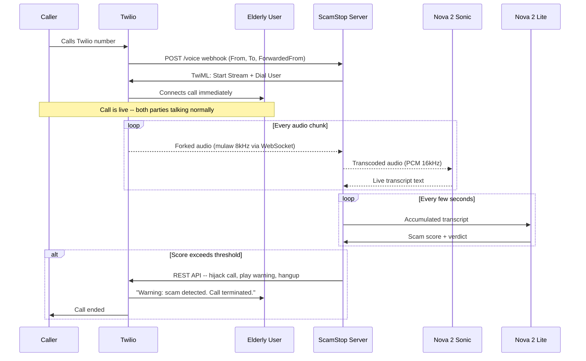

# ScamStop: AI-Powered Scam Call Protection Backend

## Hackathon Fit

- **Category:** Voice AI
- **Nova models used:** Nova 2 Sonic (real-time passive transcription), Nova 2 Lite (scam reasoning/sentiment)
- **Social good angle:** Protecting elderly from phone fraud

## Architecture: "Connect First, Monitor Silently, Kill If Needed"

The call connects to the user **immediately** with zero delay. The AI listens passively in the background and can terminate the call at any point.




## How It Works

1. **Caller dials the Twilio number** (which the elderly user's phone forwards to)
2. **Twilio hits our webhook** with caller info including `From` (caller number), `To` (Twilio number), and `ForwardedFrom` (the user's real number, carrier-dependent)
3. **Server responds with TwiML** that does two things simultaneously:
  - `<Start><Stream url="wss://..." track="both_tracks"/>` -- forks a copy of the audio to our WebSocket (passive, not in audio path)
  - `<Dial>+user_phone_number</Dial>` -- connects the call to the elderly user **immediately**
4. **The call is live** -- caller and user talk normally with no delay or interference
5. **Meanwhile, our server silently receives** the forked audio stream via WebSocket
6. **Audio is transcoded** (mulaw 8kHz -> PCM 16kHz) and fed to **Nova 2 Sonic** for real-time transcription
7. **Transcripts accumulate** and are periodically sent to **Nova 2 Lite** with a scam-detection system prompt
8. **Nova 2 Lite returns a scam score** based on the full conversation context
9. **If the score crosses the threshold**, the server uses the Twilio REST API to:
  - Hijack the live call
  - Play a warning to the user: *"This call has been terminated. Scam activity detected."*
  - Hang up

## TwiML Response (the key piece)

```xml
<Response>
    <Start>
        <Stream url="wss://your-server/monitor" track="both_tracks" />
    </Start>
    <Dial>+1234567890</Dial>
</Response>
```

This is the entire trick: `<Start><Stream>` runs **in the background** (passive tap), while `<Dial>` connects the call **immediately**. The stream is a non-blocking fork of the audio -- it does not add latency to the call.

## Twilio Webhook Parameters

When a forwarded call arrives, Twilio sends:

- `From` -- the original caller's number (the potential scammer)
- `To` -- the Twilio number
- `ForwardedFrom` -- the number that forwarded the call (the elderly user's SIM number). **Note: carrier-dependent, not all carriers provide this.** For reliability, we also maintain a config mapping Twilio numbers to user profiles.
- `CallSid` -- unique call ID, needed for the kill switch

## Audio Format (One-Way Only)

We only need to **receive and decode** audio (passive monitoring). No audio is sent back through the stream.

- Twilio sends: mulaw, 8000 Hz, mono, base64-encoded
- Nova 2 Sonic expects: PCM 16-bit, 16000 Hz, mono
- Conversion: decode mulaw -> upsample 8kHz to 16kHz

## Tech Stack

- **Runtime:** Node.js
- **Telephony:** Twilio Voice + unidirectional Media Streams (`<Start><Stream>`)
- **AI Transcription:** Amazon Nova 2 Sonic via Bedrock (model: `amazon.nova-2-sonic-v1:0`) -- passive transcription mode
- **AI Reasoning:** Amazon Nova 2 Lite via Bedrock Converse API (model: `amazon.nova-2-lite-v1:0`) -- scam sentiment analysis
- **Kill Switch:** Twilio REST API `calls(sid).update()` to terminate or redirect calls
- **Auth:** Bedrock API Key from existing setup (validate for streaming; fall back to IAM if needed)

## Project Structure: `nova/scamkill/`

- `server.js` -- Main entry: HTTP server (Twilio webhook) + WebSocket server (Media Stream listener)
- `sonic.js` -- Nova 2 Sonic passive transcription client
- `analyzer.js` -- Nova 2 Lite scam detection (accumulative scoring)
- `audio.js` -- mulaw decode + upsample (one-way: Twilio -> Nova)
- `call-manager.js` -- Twilio REST API wrapper (kill switch + call info)
- `config.js` -- User profiles, thresholds, Twilio number -> user mapping
- `package.json` -- Dependencies
- `.env.example` -- Required environment variables

## Dependencies

- `@aws-sdk/client-bedrock-runtime` -- Bedrock API (Nova models)
- `@smithy/node-http-handler` -- HTTP/2 handler for Nova Sonic streaming
- `twilio` -- Twilio SDK (REST API + TwiML generation)
- `ws` -- WebSocket server
- `dotenv` -- Environment variable management

## Implementation Phases

### Phase 1: Core Pipeline (This Session)

Call the Twilio number -> call connects to user immediately -> server logs live transcripts from Nova 2 Sonic -> Nova 2 Lite scam analysis runs continuously -> kill switch terminates scam calls.

### Phase 2: Dashboard + Alerts (Next)

Web dashboard showing active calls, live transcripts, scam scores. Push notifications to user.

### Phase 3: Android App (Later)

Native Kotlin app with CallScreeningService (auto-reject unknowns) + Twilio Voice SDK (optional VoIP path).